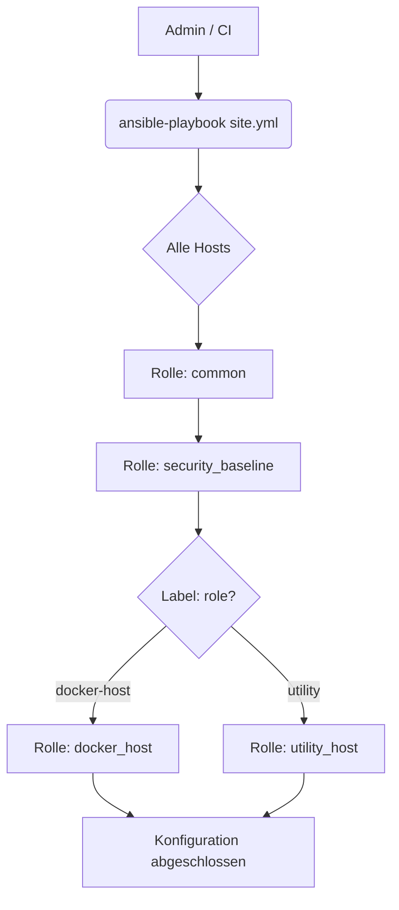

# Ansible Konfigurations-Dokumentation

Diese Dokumentation beschreibt die automatisierten Konfigurationsschritte, die via Ansible auf den Zielsystemen durchgeführt werden. Alle Rollen sind **100% idempotent** ausgelegt – sie können beliebig oft ausgeführt werden, ohne das System in einen inkonsistenten Zustand zu bringen.

## 1. Playbook-Ablauf

Das Haupt-Playbook (`site.yml`) ist modular aufgebaut. Während die Basis-Konfiguration auf allen Servern angewendet wird, erfolgt die Zuweisung spezialisierter Rollen automatisch basierend auf den Server-Labels.

---

## 5. Rolle: utility_host (Infrastruktur-Dienste)

Die Rolle `utility_host` ist für Server vorgesehen, die administrative Hilfsaufgaben oder zentrale Infrastruktur-Dienste übernehmen (z.B. Bastion-Hosts, Monitoring-Einstiegspunkte oder Backup-Knoten).

### Aufgaben & Funktionen
1. **Rollen-Verifikation**: Ein Sicherheitscheck stellt sicher, dass die Rolle nur auf dafür vorgesehenen Hosts (Label `role: utility`) ausgeführt wird.
2. **System-Vorbereitung**: Optimierung des Systems für Hintergrund-Tasks und administrative Werkzeuge.
3. **Erweiterbarkeit**: Diese Rolle dient als Basis für zukünftige Dienste:
   - **Backup-Management**: Zentrale Steuerung von Datenbank-Dumps und Dateisicherungen.
   - **Monitoring-Aggregatoren**: Sammeln von Metriken der anderen Cluster-Knoten.
   - **CI/CD Runner**: Lokale Ausführung von Build-Prozessen.

---

## 2. Rolle: common (Basis-Konfiguration)

Die Rolle `common` stellt sicher, dass grundlegende Systemparameter auf allen Hosts identisch gesetzt sind.

### Aufgaben
1. **Timezone**: Die Systemzeit wird einheitlich auf **UTC** gesetzt, um Log-Analysen über verschiedene Zeitzonen hinweg zu vereinfachen.
2. **Journald-Optimierung**:
   - `SystemMaxUse=500M`: Begrenzt den Speicherplatz der Systemd-Logs auf 500 MB.
   - `MaxRetentionSec=1month`: Logs werden maximal einen Monat aufbewahrt.
   - Dies verhindert, dass die Festplatte durch ausufernde Log-Dateien vollgestillt wird.

---

## 3. Rolle: security_baseline (System-Härtung)

Diese Rolle implementiert grundlegende Sicherheitsmaßnahmen, um den SSH-Zugang abzusichern.

### Maßnahmen
1. **Password Authentication**: Deaktiviert den passwortbasierten Login (`PasswordAuthentication no`). Zugriff ist nur noch via SSH-Key möglich.
2. **Root Login**: Verhindert den direkten Root-Login via Passwort (`PermitRootLogin prohibit-password`). Dies zwingt Angreifer dazu, einen existierenden User-Account zu kennen oder Key-basierte Authentifizierung zu nutzen.

Diese Änderungen werden durch einen automatischen Reload des SSH-Dienstes sofort wirksam.

---

## 4. Rolle: docker_host (Applikations-Laufzeit)

Diese Rolle installiert die Docker Engine und alle notwendigen Komponenten für den Betrieb von Container-basierten Workloads.

### Aufgaben
1. **Dependencies**: Installation von `apt-transport-https`, `ca-certificates`, `curl`, `gnupg` und `lsb-release`.
2. **Repository**: Hinzufügen des offiziellen GPG-Keys und des Docker-Repositories für Debian (stable).
3. **Docker Installation**:
   - `docker-ce`: Docker Engine.
   - `docker-ce-cli`: CLI-Tools.
   - `containerd.io`: Container-Laufzeit.
   - `docker-compose-plugin`: Docker Compose (V2) Integration.
4. **Benutzer-Berechtigungen**: Der `ansible` User wird zur `docker` Gruppe hinzugefügt, um Docker-Befehle ohne `sudo` ausführen zu können (erleichtert die CI/CD-Automatisierung).

---

## 5. Qualitätssicherung (Linting)

Um die Wartbarkeit und Sicherheit der Playbooks zu garantieren, wird `ansible-lint` eingesetzt.

- **Zweck**: Statische Analyse der YAML-Dateien auf Best Practices (z.B. korrekte Modul-Parameter, keine "naked" commands, sichere File-Berechtigungen).
- **IDE-Integration**: Der Pfad zum Executable (`/opt/homebrew/bin/ansible-lint`) kann direkt in der IDE hinterlegt werden, um Live-Feedback beim Editieren zu erhalten.
