# Ansible Konfigurations-Dokumentation

Diese Dokumentation beschreibt die automatisierten Konfigurationsschritte, die via Ansible auf den Zielsystemen durchgeführt werden. Das Ziel ist ein gehärtetes, standardisiertes und für Docker optimiertes System-Setup.

## 1. Playbook-Ablauf

Das Haupt-Playbook (`site.yml`) ist modular aufgebaut und wendet verschiedene Rollen nacheinander an, um die gewünschte Zielkonfiguration zu erreichen.

```mermaid
sequenceDiagram
    participant Admin as Admin / CI
    participant Playbook as site.yml
    participant Common as Rolle: common
    participant Sec as Rolle: security_baseline
    participant Docker as Rolle: docker_host
    participant VM as Ziel-Server

    Admin->>Playbook: ansible-playbook run
    
    rect rgb(30, 41, 59)
    Note over Playbook,Common: Phase 1: Basis-System
    Playbook->>Common: Anwenden
    Common->>VM: Timezone & Logging
    end
    
    rect rgb(51, 65, 85)
    Note over Playbook,Sec: Phase 2: Härtung
    Playbook->>Sec: Anwenden
    Sec->>VM: SSH-Hardening
    end
    
    rect rgb(15, 23, 42)
    Note over Playbook,Docker: Phase 3: Applikations-Ready
    Playbook->>Docker: Anwenden
    Docker->>VM: Docker Engine & Compose
    end

    Playbook-->>Admin: Konfiguration abgeschlossen
```

---

## 2. Rolle: common (Basis-Konfiguration)

Die Rolle `common` stellt sicher, dass grundlegende Systemparameter auf allen Hosts identisch gesetzt sind.

### Aufgaben
1. **Timezone**: Die Systemzeit wird einheitlich auf **UTC** gesetzt, um Log-Analysen über verschiedene Zeitzonen hinweg zu vereinfachen.
2. **Journald-Optimierung**:
   - `SystemMaxUse=500M`: Begrenzt den Speicherplatz der Systemd-Logs auf 500 MB.
   - `MaxRetentionSec=1month`: Logs werden maximal einen Monat aufbewahrt.
   - Dies verhindert, dass die Festplatte durch ausufernde Log-Dateien vollgestillt wird.
