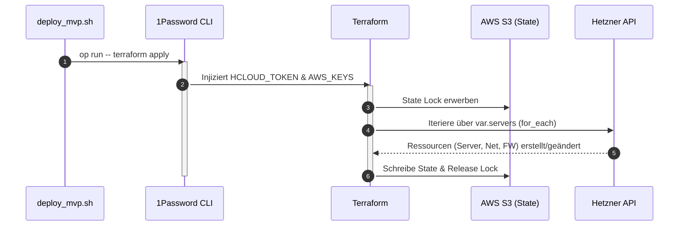
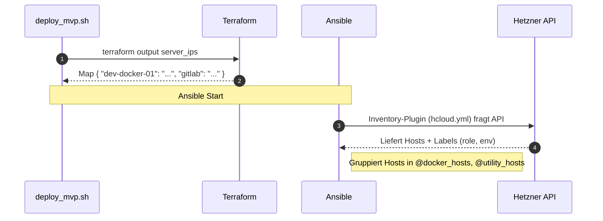
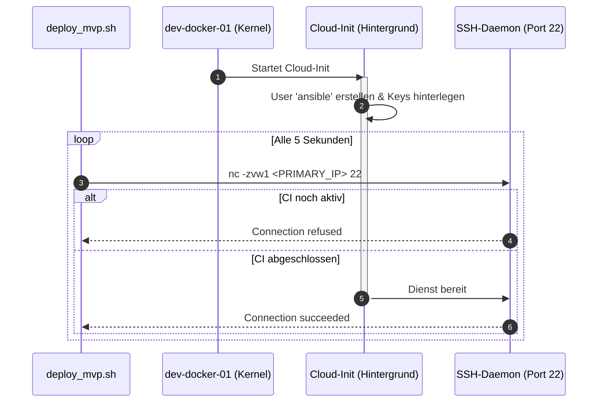
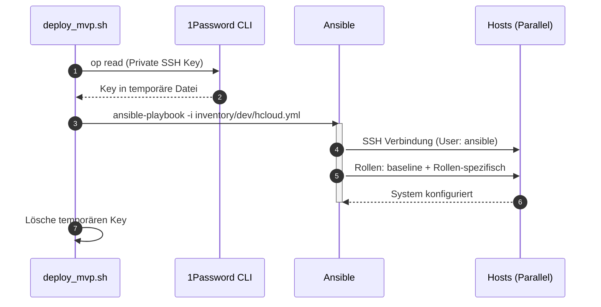

# Deployment Architektur (`deploy_mvp.sh`)

Dieses Dokument veranschaulicht die exakte Abfolge der Systemintegrationen, die bei der Ausführung von `./scripts/deploy_mvp.sh` automatisch stattfinden. Das Skript fungiert als Bindeglied zwischen unserer deklarativen Infrastruktur (Terraform), unseren "Local-First" Secrets (1Password) und dem imperativen Konfigurationsmanagement (Ansible) unter Nutzung eines **dynamischen Inventars**.

## 1. Gesamtübersicht (High-Level)

Die folgende Sequenz zeigt den vollständigen Prozess von der Initialisierung bis zum erfolgreichen Deployment.

```mermaid
sequenceDiagram
    autonumber

    actor Admin
    participant Script as deploy_mvp.sh
    participant 1Pwd as 1Password CLI
    participant TF as Terraform
    participant S3 as S3 State Backend
    participant HCloud as Hetzner API
    participant Ansible as Ansible
    participant VM as Hosts (Docker/GitLab)

    Admin->>Script: Führe ./deploy_mvp.sh aus

    rect rgb(30, 41, 59)
    Note over Script,HCloud: Schritt 1: Infrastruktur Provisionierung
    Script->>1Pwd: op run (Liest .env)
    1Pwd-->>Script: Injiziert Secrets (HCLOUD_TOKEN, AWS_*)
    Script->>TF: terraform apply -auto-approve
    TF->>S3: Authentifizierung & State Lock
    TF->>HCloud: Erstellt/Abgleicht Server-Map (for_each)
    HCloud-->>TF: Server bereit (Labels gesetzt)
    TF->>S3: State Update
    TF-->>Script: Apply abgeschlossen
    end

    rect rgb(51, 65, 85)
    Note over Script,TF: Schritt 2: Dynamische Inventory Erkennung
    Script->>TF: op run -- terraform output server_ips
    TF-->>Script: JSON-Map der IPs (dev-docker-01, gitlab, etc.)
    Note over Script: Kein manuelles Patching der hosts.ini notwendig!
    end

    rect rgb(71, 85, 105)
    Note over Script,VM: Schritt 3: Warten auf Boot & Netzwerk
    loop Für Primär-Host (dev-docker-01)
        Script->>VM: nc -zvw1 <IP> 22
        VM-->>Script: Connection Succeeded
    end
    end

    rect rgb(15, 23, 42)
    Note over Script,VM: Schritt 4: Konfigurationsmanagement
    Script->>1Pwd: op read (SSH Key)
    1Pwd-->>Script: Key bereitgestellt
    Script->>Ansible: ansible-playbook (i hcloud.yml)
    Ansible->>HCloud: API-Abfrage: Welche Server haben welche Labels?
    HCloud-->>Ansible: Liste: dev-docker-01 (docker), gitlab (utility)
    Ansible->>VM: Parallel: Rollen ausführen (common, security, roles/...)
    VM-->>Ansible: Fertig
    Ansible-->>Script: Playbook abgeschlossen
    end

    Script-->>Admin: Deployment erfolgreich!
```

---

## 2. Detaillierte Prozessschritte

### Schritt 1: Infrastruktur Provisionierung (Multi-Server)

In diesem Schritt wird die gesamte Infrastruktur-Map bei Hetzner Cloud abgeglichen.

### Schritt 2: Dynamische Inventar-Discovery

Anstelle von `sed` im Inventory nutzen wir nun die direkte API-Abfrage.

### Schritt 3: Verbindungsprüfung (SSH-Boot-Check)

Der Script-Loop wartet auf die Erreichbarkeit des primären Management-Nodes.

### Schritt 4: Konfigurationsmanagement (Ansible & 1Password)

Die sichere Übergabe des SSH-Keys an Ansible.

---

## Architekturentscheidungen

### 1. Label-basiertes Discovery
Die Wahrheit über die Funktion eines Servers liegt nicht in einer statischen Textdatei, sondern als Metadaten (`Labels`) direkt an der Ressource in der Cloud. Dies ermöglicht echtes Auto-Scaling.

### 2. S3 State & Locking
Der Infrastruktur-Status wird zentral im S3-Backend gespeichert. Dies ermöglicht Teamarbeit und verhindert gleichzeitige Änderungen durch automatisches Locking.

### 3. SSH-Agent Isolation
Zur Erhöhung der Sicherheit und Automatisierbarkeit umgehen wir den SSH-Agenten und injizieren den Key direkt aus 1Password pro Session.
