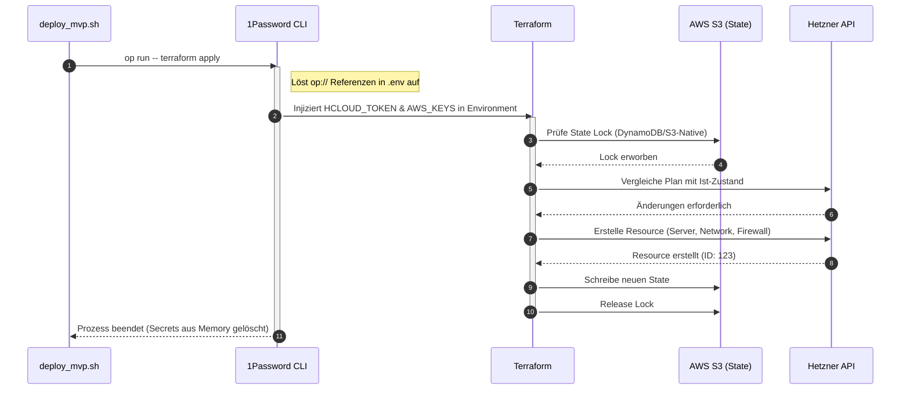
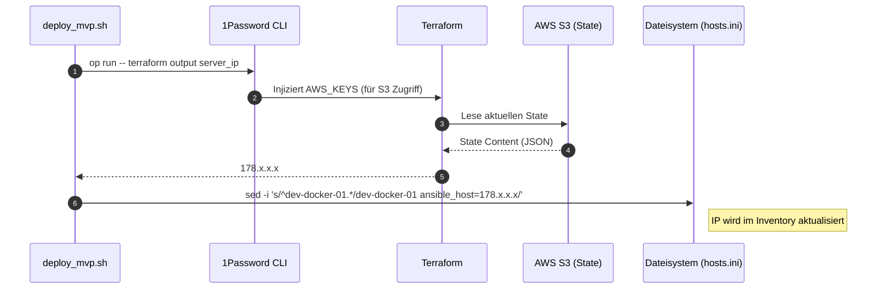
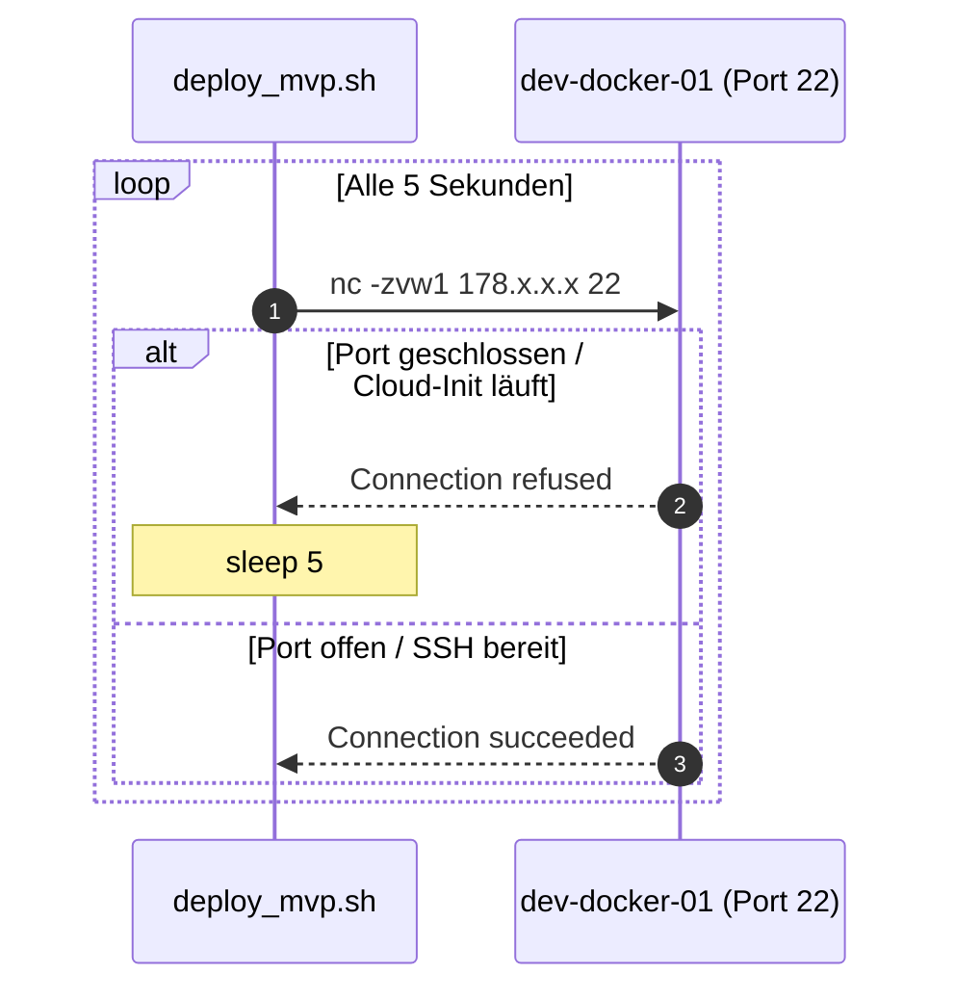
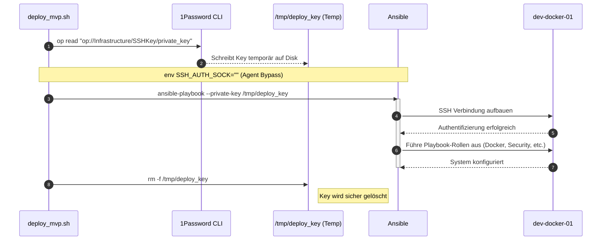

# Deployment Architektur (`deploy_mvp.sh`)

Dieses Dokument veranschaulicht die exakte Abfolge der Systemintegrationen, die bei der Ausführung von `./scripts/deploy_mvp.sh` automatisch stattfinden. Das Skript fungiert als Bindeglied zwischen unserer deklarativen Infrastruktur (Terraform), unseren "Local-First" Secrets (1Password) und dem imperativen Konfigurationsmanagement (Ansible).

## 1. Gesamtübersicht (High-Level)

Die folgende Sequenz zeigt den vollständigen Prozess von der Initialisierung bis zum erfolgreichen Deployment.

---

## 2. Detaillierte Prozessschritte

### Schritt 1: Infrastruktur Provisionierung (Terraform & S3)

In diesem Schritt wird die physische (bzw. virtuelle) Infrastruktur bei Hetzner Cloud erzeugt. Die Sicherheit wird durch die In-Memory Injection von Secrets via 1Password gewährleistet.

### Schritt 2 & 3: IP Extraktion & Inventory Update

Nachdem die VM existiert, muss ihre öffentliche IP-Adresse ermittelt und in das Ansible-Inventory (`hosts.ini`) geschrieben werden.

### Schritt 4: Verbindungsprüfung (SSH-Boot-Check)

Bevor Ansible starten kann, muss sichergestellt sein, dass die VM nicht nur "läuft", sondern auch via SSH erreichbar ist (Cloud-Init abgeschlossen).

### Schritt 5: Konfigurationsmanagement (Ansible & 1Password)

Der kritischste Schritt: Die sichere Übergabe des SSH-Keys an Ansible ohne Nutzung eines lokalen SSH-Agenten, um Interaktivität zu vermeiden.

---

```mermaid
sequenceDiagram
    autonumber
    
    actor Admin
    participant Script as deploy_mvp.sh
    participant 1Pwd as 1Password CLI
    participant TF as Terraform
    participant S3 as S3 State Backend
    participant HCloud as Hetzner API
    participant Ansible as Ansible
    participant VM as dev-docker-01

    Admin->>Script: Führe ./deploy_mvp.sh aus

    rect rgb(30, 41, 59)
    Note over Script,HCloud: Schritt 1: Infrastruktur Provisionierung
    Script->>1Pwd: op run (Liest .env)
    1Pwd-->>Script: Injiziert Secrets (HCLOUD_TOKEN, AWS_*)
    Script->>TF: terraform apply -auto-approve
    TF->>S3: Authentifizierung & State Lock (via op run)
    TF->>HCloud: Provisioniert Netzwerk, Firewall, VM
    HCloud-->>TF: Erfolgreich (VM ist hochgefahren)
    TF->>S3: State Update & Unlock
    TF-->>Script: Apply abgeschlossen
    end

    rect rgb(51, 65, 85)
    Note over Script,TF: Schritt 2 & 3: IP Extraktion & Inventory Update
    Script->>TF: op run -- terraform output server_ip
    TF-->>Script: 178.x.x.x
    Script->>Script: sed: Aktualisiert hosts.ini mit der IP
    end

    rect rgb(71, 85, 105)
    Note over Script,VM: Schritt 4: Warten auf Boot & Netzwerk
    loop Prüft Erreichbarkeit von Port 22 (TCP)
        Script->>VM: nc -zvw1 178.x.x.x 22
        VM-->>Script: Connection Refused (Verbindung abgelehnt)
        Note over Script: sleep 5
        VM-->>Script: Connection Succeeded (Verbindung erfolgreich - Cloud-init beendet)
    end
    end

    rect rgb(15, 23, 42)
    Note over Script,VM: Schritt 5: Konfigurationsmanagement
    Script->>1Pwd: op read (Liest Private SSH Key via UUID)
    1Pwd-->>Script: Schreibt Private Key in /tmp/file
    Note over Script,Ansible: SSH Agent Bypass (env SSH_AUTH_SOCK="")
    Script->>Ansible: ansible-playbook --private-key /tmp/file
    Ansible->>VM: Verbindet sich über SSH (User: ansible)
    VM-->>Ansible: Authentifiziert!
    Ansible->>VM: Führt Rollen aus: common, security, docker
    VM-->>Ansible: Fertig
    Ansible-->>Script: Playbook abgeschlossen
    end

    Script->>Script: rm -f /tmp/file (Löscht den Key auf der Festplatte)
    Script-->>Admin: Deployment erfolgreich! Server IP: 178.x.x.x
```

## Architekturentscheidungen & Erläuterungen

### 1. 1Password "Local-First" Injection (`op run`)
Terraform benötigt zwingend API-Tokens (`HCLOUD_TOKEN`) und S3 Backend Zugangsdaten (`AWS_ACCESS_KEY_ID`, `AWS_SECRET_ACCESS_KEY`) als Umgebungsvariablen. Anstatt diese im Klartext auf der Festplatte zu speichern, ruft das Skript Terraform gebündelt über `op run` auf. Die 1Password CLI fängt die Ausführung ab, löst die `op://...` Referenzen aus der `.env` Datei auf, injiziert die entschlüsselten Werte absolut sicher und exklusiv in den Arbeitsspeicher (Memory) des Terraform-Prozesses und bereinigt alles restlos, sobald der Vorgang beendet ist.

### 2. S3 State Backend Authentifizierung
Um Nebenläufigkeitsprobleme (Concurrency) zu verhindern und den Zustand der Cloud (State) sicher außerhalb des lokalen Repositories zu speichern, war der Wechsel auf ein S3-Bucket zwingend notwendig. Da der Befehl `terraform output` für die IP-Extraktion **ebenfalls** mit genau diesem S3-Backend kommunizieren muss, wird im Skript auch Schritt 2 via `op run` gestartet. So wird der fatale `"No valid credential sources found"` Fehler vermieden.

### 3. SSH Agent Bypass (`env SSH_AUTH_SOCK=""`)
Ein vollständig automatisiertes Playbook darf nicht unerwartet durch lokale 1Password Biometrie-Prompts blockiert oder durch "communication with agent failed" Socket-Fehler abstürzen. Das erreichen wir, indem dem SSH-Client des Systems gezielt der Zugang zum Agenten verwehrt wird (`SSH_AUTH_SOCK=""`). Stattdessen vertrauen wir einzig und allein auf die per UUID in Echtzeit von 1Password gezogene Datei über das `--private-key` Argument von Ansible. Auf diese Weise garantieren wir ein deterministisches und stets fehlerfrei durchlaufendes Deployment.
