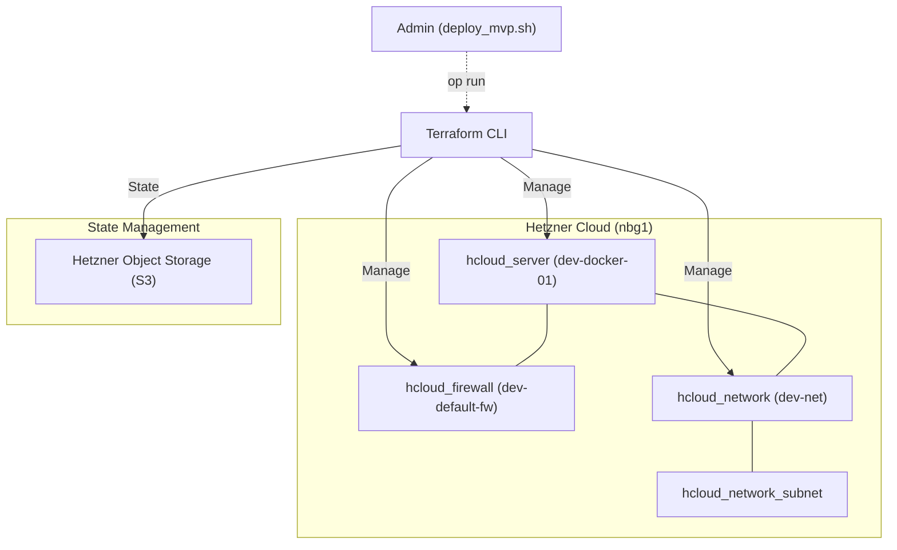

# Terraform Infrastruktur-Dokumentation

Diese Dokumentation beschreibt die durch Terraform verwalteten Ressourcen, ihre Konfiguration und die zugrunde liegende Architektur. Das Ziel ist eine reproduzierbare, sichere und performante Infrastruktur auf Basis der Hetzner Cloud (HCloud).

## 1. Infrastruktur-Übersicht

Die Infrastruktur folgt einem modularen Ansatz, bei dem Netzwerk, Firewall und Compute-Instanzen (Server) getrennt voneinander definiert und miteinander verknüpft sind.

## 2. Remote State (S3 Backend)

Um Konsistenz in Team-Umgebungen zu gewährleisten und den Infrastruktur-Status sicher zu speichern, nutzt dieses Projekt ein S3-kompatibles Backend auf dem **Hetzner Object Storage**.

- **Bucket**: `ef-infra`
- **Key**: `dev/terraform.tfstate`
- **Endpoint**: `https://fsn1.your-objectstorage.com`

### Besonderheiten
- **Sicherheit**: Die Authentifizierung erfolgt ausschließlich über 1Password (`op run`), wodurch keine AWS-Keys lokal gespeichert werden müssen.
- **Konfiguration**: Aufgrund der Nutzung von Hetzner S3 (nicht AWS) sind diverse Validierungen deaktiviert (`skip_region_validation`, `skip_credentials_validation`, etc.), um Kompatibilität sicherzustellen.

---

## 3. Netzwerk (Private Cloud)

Die Infrastruktur nutzt ein isoliertes privates Netzwerk (`hcloud_network`), um den Traffic zwischen den Komponenten sicher zu gestalten.

- **Name**: `dev-net`
- **Adressraum**: `10.1.0.0/16`
- **Subnetz**: `10.1.1.0/24` (Zone: `eu-central`)

### Integration
Server werden primär über das private Netzwerk miteinander verbunden. Dies reduziert die Angriffsfläche im öffentlichen Internet und sorgt für geringe Latenzen.

---

## 4. Sicherheitsgruppen (Firewall)

Zentrale Firewall-Regeln (`hcloud_firewall`) steuern den ein- und ausgehenden Datenverkehr.

- **Name**: `dev-default-fw`

### Inbound Regeln
| Protokoll | Port | Quelle | Zweck |
|-----------|------|--------|-------|
| TCP | 22 | `var.allowed_ssh_ips` | Sicherer SSH-Zugriff (via deploy_mvp.sh) |
| ICMP | any | `0.0.0.0/0`, `::/0` | Ping / Diagnose erreichbar |

### Outbound Regeln
- **TCP/UDP**: Alle Ports sind nach außen hin offen (`0.0.0.0/0`, `::/0`), um Updates (apt, docker) und Kommunikation mit externen APIs zu ermöglichen.

---

## 5. Compute Instanzen (Server)

Die Hauptinstanz (`hcloud_server`) dient als Docker-Host und wird automatisiert provisioniert.

- **Name**: `dev-docker-01`
- **Typ**: `cx23` (2 vCPU, 4 GB RAM)
- **Image**: `debian-13`
- **Location**: `nbg1` (Nürnberg)

### Cloud-Init (Bootstrapping)
Für die initiale Konfiguration wird das `user_data` Template genutzt. Dies ermöglicht ein "headless" Deployment ohne manuelle Eingriffe.

- **Benutzer**: Ein administrativer User `ansible` wird angelegt.
- **SSH**: Der öffentliche Schlüssel des Admins wird hinterlegt, um den Zugriff in Schritt 5 des Deployments zu ermöglichen.
- **Automatisierung**: Cloud-Init bereitet das System so weit vor, dass Ansible nach Erreichbarkeit des SSH-Ports sofort übernehmen kann.

---

## 6. Modulares Design & Best Practices

In dieser Infrastruktur wurde bewusst auf ein modulares Design Wert gelegt.

### Warum mehrfache `versions.tf` Dateien?
Obwohl alle Komponenten aktuell dieselbe Provider-Version (`hcloud >= 1.60`) nutzen, besitzt jedes Modul (Network, Firewall, Server) eine eigene `versions.tf`.

- **Portabilität**: Jedes Modul ist in sich abgeschlossen. Es kann problemlos in andere Projekte kopiert werden, ohne dass dort manuell nach den benötigten Providern gesucht werden muss.
- **Zukunftssicherheit**: Sollte ein Modul in Zukunft eine spezifischere Version eines Providers benötigen, kann dies lokal im Modul gesteuert werden, ohne die globale Konfiguration zu beeinflussen.
- **Standard-Konformität**: Dies entspricht den gängigen Terraform Best Practices für die Modulentwicklung.
