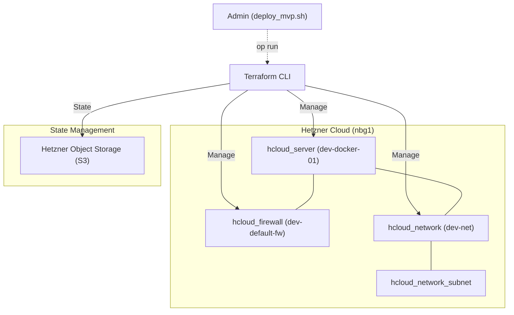

# Terraform Infrastruktur-Dokumentation

Diese Dokumentation beschreibt die durch Terraform verwalteten Ressourcen, ihre Konfiguration und die zugrunde liegende Architektur. Das Ziel ist eine reproduzierbare, sichere und performante Infrastruktur auf Basis der Hetzner Cloud (HCloud).

## 1. Infrastruktur-Übersicht

Die Infrastruktur folgt einem modularen Ansatz, bei dem Netzwerk, Firewall und Compute-Instanzen (Server) getrennt voneinander definiert und miteinander verknüpft sind.

## 2. Remote State (S3 Backend)

Um Konsistenz in Team-Umgebungen zu gewährleisten und den Infrastruktur-Status sicher zu speichern, nutzt dieses Projekt ein S3-kompatibles Backend auf dem **Hetzner Object Storage**.

- **Bucket**: `ef-infra`
- **Key**: `dev/terraform.tfstate`
- **Endpoint**: `https://fsn1.your-objectstorage.com`

### Besonderheiten
- **Sicherheit**: Die Authentifizierung erfolgt ausschließlich über 1Password (`op run`), wodurch keine AWS-Keys lokal gespeichert werden müssen.
- **Konfiguration**: Aufgrund der Nutzung von Hetzner S3 (nicht AWS) sind diverse Validierungen deaktiviert (`skip_region_validation`, `skip_credentials_validation`, etc.), um Kompatibilität sicherzustellen.
